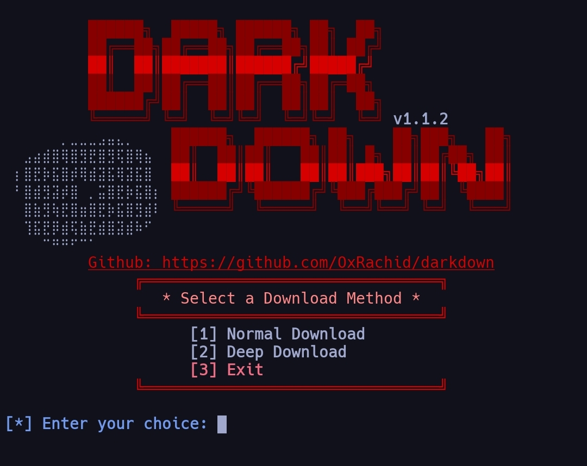

# Darkdown

A powerful YouTube video and audio downloader using yt-dlp

Features:
- Download YouTube videos in high quality from source servers
- Download audio in best quality
- Download video in a specific format (mp4/webm...etc)


## Requirements
- Python 3.6 or higher

## Installation and Usage Guide
To install Darkdown, follow these steps. 
in fact there are many ways of installation and you can choose any of them based on your main need...

# Quick installation
this is the easy way to install darkdown by just one command-line
copy this command-line and run it in your terminal

```bash
pip install git+https://github.com/OxRachid/darkdown.git
```

That's it! Now you can use Darkdown from anywhere:
```bash
darkdown
```

## Alternative Installation (If you want to see the code)

1. Clone the repository:
```bash
git clone https://github.com/OxRachid/darkdown.git
cd darkdown
```

2. Run the installer:
```bash
pip install -e .
```

And now you can use darkdown by just type:
```bash
darkdown
```

## Release installation
1. Download the latest release from darkdown release 
2. Extract the downloaded .zip or .tar.gz file.
3. In the extracted folder, run:
```bash
pip install -e .
```
4. Once installed, you can use darkdown as a command in the terminal


## Troubleshooting

If you encounter any issues:

1. Make sure Python is installed:
```bash
python --version
```

2. Try reinstalling:
```bash
pip uninstall darkdown
pip install git+https://github.com/OxRachid/darkdown.git
```

## Updates

To update to the latest version:
```bash
pip install --upgrade git+https://github.com/OxRachid/darkdown.git
```

## Recommendation
For best results, install within a virtual environment to avoid conflicts with other Python packages.
Here’s a sample steps and instractions for creating a virtual environment to install darkdown:
   ⦁ step 1: clone darkdown repository:
```bash
git clone https://github.com/OxRachid/darkdown.git
```
   ⦁ step 2: Create and Manage Global Virtual Environments 
   1. Create a centralized directory (Global directory for all virtual environments):
```bash
mkdir ~/venvs
```
   2. Create a unique virtual environment for darkdown progect in this directory:
```bash
python -m venv ~/venvs/darkdown_env
```  
   3. Activate the virtual environment
before working on the project or installing its pkgs or dependencies. You’ll want to do this each time you work on a project:
   * On macOS/Linux:
```bash
source ~/venvs/darkdown_env/bin/activate 
```
   * On Windows:
```bash
~/venvs/darkdown_env\Scripts\activate 
```
   4. Run the installer:
After activating the environment, navigate to darkdown project directory and install the necessary packages:
```bash
pip install -e .
```
When you’ve activated darkdown_env, you’re free to run, develop, or test within darkdown without affecting your other python projects in your system. Then, deactivate the environment once you’re finished:
```bash
deactivate
```
after deactivate the environment you can still use and run darkdown.

