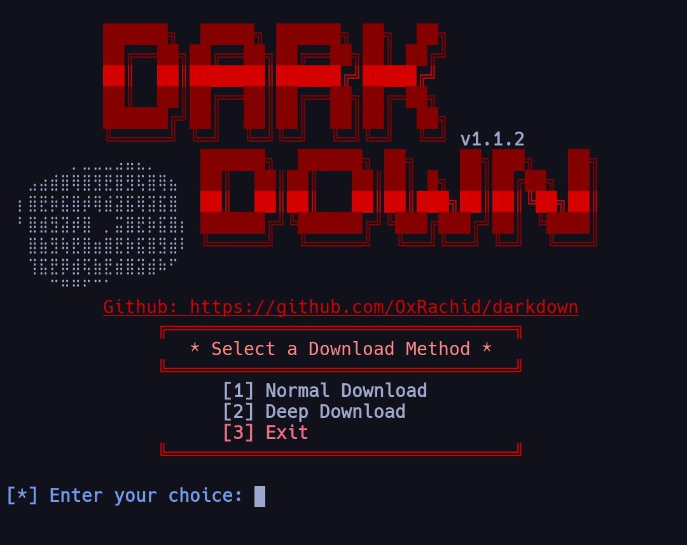

# 📥 Darkdown

A powerful video and audio downloader built on top of `yt-dlp`.

---

## ✨ Features
* 🌍 **Multi-Site Support:** Download from YouTube, Instagram, Facebook, and more.
* 💎 **High Quality:** Fetches content directly from source servers in the best resolution.
* 🎬 **Flexible Formats:** Choose specific formats like `mp4`, `webm`, or high-quality audio.
* 📱 **Cross-Platform:** Full support for Linux, macOS, Windows, and **Termux**.

---

## 🛠️ Prerequisites
Before installing, ensure you have the following tools ready:

1. **Python 3.6+** 🐍
2. **FFmpeg:** Required for merging video and audio streams.
   - **Termux:**
     ```bash
     pkg install ffmpeg
     ```
   - **Linux (Ubuntu/Debian):**
     ```bash
     sudo apt update && sudo apt install ffmpeg
     ```
   - **macOS:**
     ```bash
     brew install ffmpeg
     ```
   - **Windows:** Download from [ffmpeg.org](https://ffmpeg.org/download.html) and add to PATH.

---

## 🚀 Installation & Usage

### 1️⃣ Quick Installation (Recommended)
Use this method if you just want to use the tool without managing the source code.
```bash
pip install git+https://github.com/OxRachid/darkdown.git
```

### 2️⃣ Developer Installation (Editable Mode)
Use this method if you want to modify the code or contribute to the project.
```bash
git clone https://github.com/OxRachid/darkdown.git
cd darkdown
pip install -e .
```
> 💡 **Note on the -e flag:** This stands for **Editable**. It links the installation to your local folder, so any changes you make to the .py files take effect immediately without needing to reinstall.

---

## 🔄 Updating & Troubleshooting

### How to Update
Sites like YouTube frequently update their code. To keep **Darkdown** working, you must keep the "Engine" (dependencies) updated.

#### 📦 For Quick Installations:
Run this command to update both the tool and its core dependencies:
```bash
pip install -U --upgrade-strategy eager git+https://github.com/OxRachid/darkdown.git
```

#### 🛠️ For Developer Installations (Best Practice):
If you have made local changes to the code, follow this workflow to merge your work with the latest official updates safely:

1. **Stash your local changes:**
   ```bash
   git Stash
   ```
2. **Pull the latest official code:**
   ```bash
   git pull origin main
   ```
3. **Re-apply your changes:**
   ```bash
   git stash pop
   ```
4. **Update the "Engine" (Dependencies):**
   ```bash
   pip install -U --upgrade-strategy eager .
   ```

  **Verify Dependencies:**
  ```bash
  ffmpeg -version
  ```

---

## 📂 Storage & Configuration

Darkdown uses a `config.ini` file to manage save paths.

| 🌐 Platform          | 🎬 Default Video Path                         | 🎵 Default Audio Path**                      |
|----------------------|-----------------------------------------------|----------------------------------------------|
| **Linux/macOS**      | `~/Videos/darkdown`                           | `~/Music/darkdown`                           |
| **Windows**          | `C:\Users\<YourName>\Videos\darkdown`         | `C:\Users\<YourName>\Music\darkdown`         |
| **Termux**           | `~/storage/shared/darkdown/videos`            | `~/storage/shared/darkdown/audios`           |

#### ⚙️ Custom Configuration
You can customize your storage paths by editing the config.ini file located in your project directory.

```ini
[Paths]
video_dir = /path/to/your/custom/video/folder
audio_dir = /path/to/your/custom/audio/folder

> ⚠️ **Termux Users:** Run `termux-setup-storage` first to allow access to internal memory.

---


## 💡 Pro-Tip: Virtual Environments
To keep your system clean and avoid package conflicts:

```bash
# 1. Create Env
python -m venv ~/darkdown_env

# 2. Activate (Linux/Termux)
source ~/darkdown_env/bin/activate

# 3. Install
pip install git+https://github.com/OxRachid/darkdown.git
```

---

## ❌ Uninstall
```bash
pip uninstall darkdown
```
